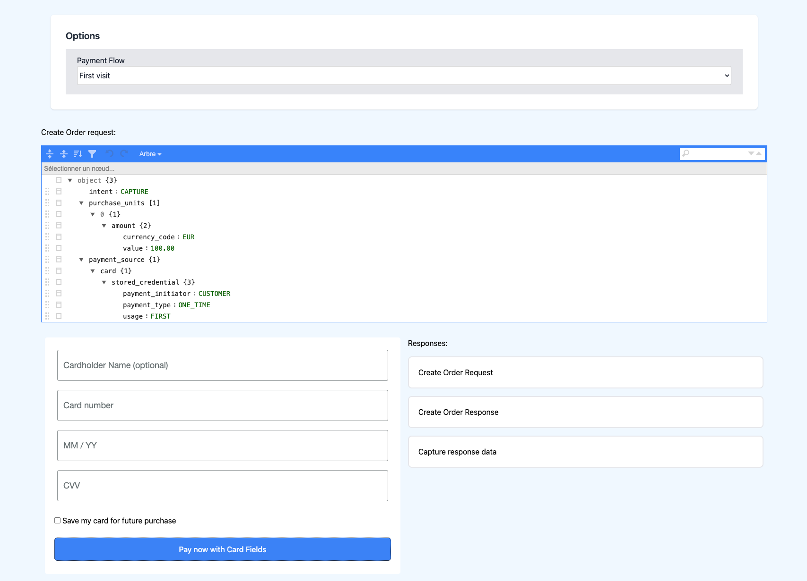
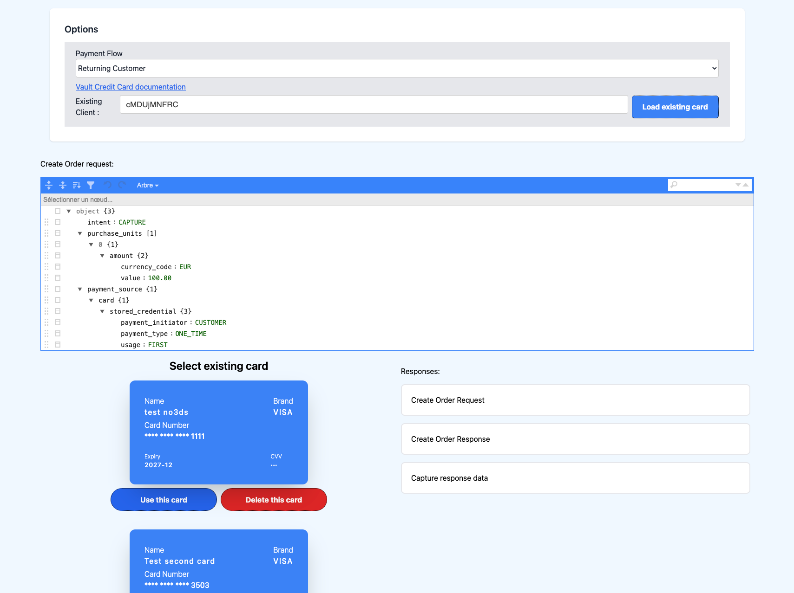

# Advanced Integration Example

This folder contains example of a Credit Card Vaulting via PayPal advanced Checkout integration using the JavaScript SDK and Node.js to complete transactions with the PayPal REST API.
Here is the documentation [https://developer.paypal.com/docs/checkout/save-payment-methods/during-purchase/orders-api/cards/](https://developer.paypal.com/docs/checkout/save-payment-methods/during-purchase/orders-api/cards/) 

### Table of Contents

- [Instructions](#instructions)
- [Usage](#usage)
- [ThreeDSecure](#ThreeDSecure)
- [Screenshots](#screenshots)

## Instructions

1. [Create an application](https://developer.paypal.com/dashboard/applications/sandbox/create)
2. Rename `.env.example` to `.env` and update `PAYPAL_CLIENT_ID` and `PAYPAL_CLIENT_SECRET`.
3. Run `npm install`
4. Run `npm start`
5. Open http://localhost:8888
6. Enter the credit card number provided from one of your [sandbox accounts](https://developer.paypal.com/dashboard/accounts) or [generate a new credit card](https://developer.paypal.com/dashboard/creditCardGenerator)

## Usage

1. Select the scenario : First visit or Returning Customer (see screenshots below in [Screenshots](#screenshots) section)
2. If Returning Customer is selected, enter the client ID
3. Fill in the credit card details in the card form on the left side.
4. Click the "Pay Now" button to initiate the payment process.
5. The payment process involves creating an order, handling 3D Secure data, and capturing the payment.
6. Responses for each step are displayed on the right side of the page.

## ThreeDSecure

In order to test 3D Secure scenarios, please refer to Braintree 3DS documentation https://developer.paypal.com/braintree/docs/guides/3d-secure/testing-go-live/node

## Screenshots

- First time visit

 

- Returning flow

